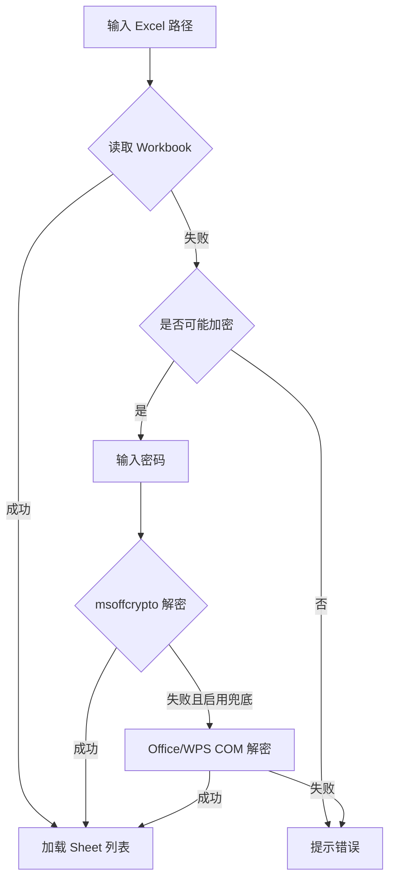
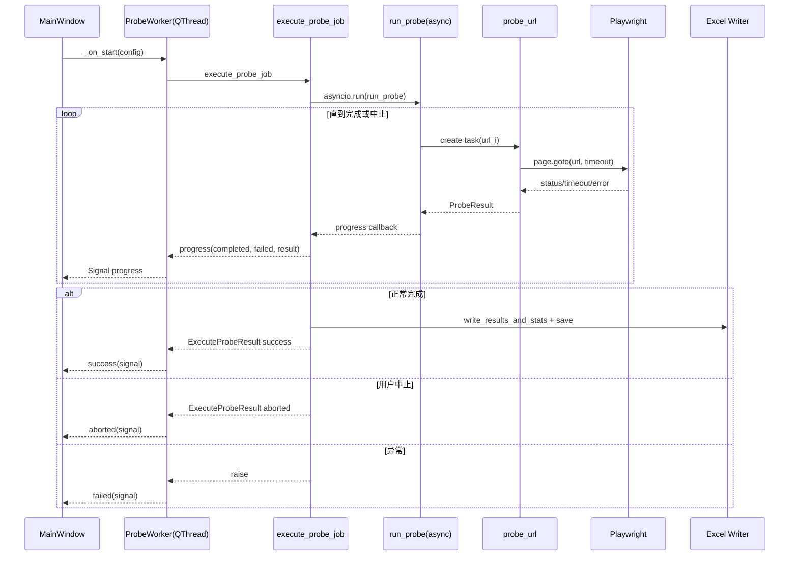
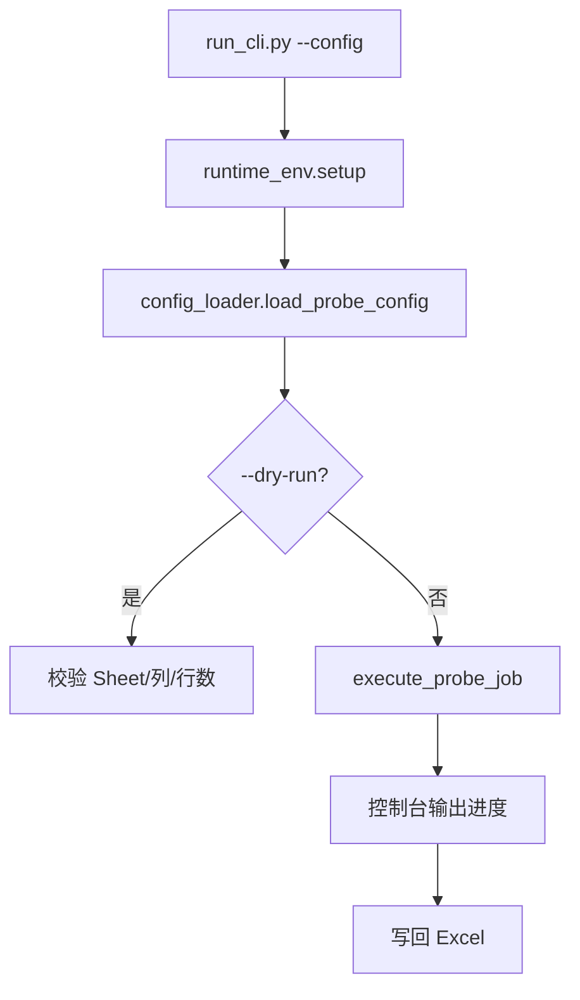
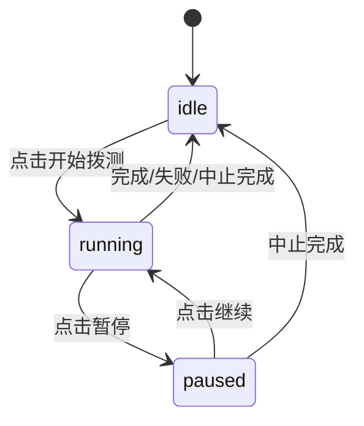

# SyntheticMonitoringTool 技术架构说明

本文档面向维护者，说明模块边界、关键流程、状态机与打包发布链路，便于后续排障与演进。

## 1. 模块划分与职责

- `run_tool.py`
  - Windows GUI 程序入口包装器。
  - 调用 `runtime_env.setup_runtime_environment()` 初始化运行时目录与环境变量。
  - 调用 `app.main()` 启动 PySide6 UI。
- `run_cli.py`
  - Ubuntu/服务器 CLI 入口（无 GUI）。
  - 读取 JSON 配置文件（`config_loader.load_probe_config`），调用 `probe_core.execute_probe_job`。
  - 支持 `--dry-run` 校验配置与 Excel 结构。
- `runtime_env.py`
  - 共用运行时初始化：`runtime-data/temp`、`runtime-data/cache`、`PLAYWRIGHT_BROWSERS_PATH`。
- `probe_core.py`
  - 平台无关核心业务：
    - Excel 读取/解密（`msoffcrypto` + Office/WPS fallback，后者仅 Windows）。
    - 网址规范化与列解析（`resolve_url_column_index`）。
    - Playwright 并发拨测（`run_probe`）、结果回写（`write_results_and_stats`）。
    - 统一任务入口 `execute_probe_job`（GUI 与 CLI 共用）。
- `config_loader.py`
  - JSON 配置文件加载、字段校验、`ProbeConfig` 组装。
- `app.py`
  - PySide6 UI 与 `ProbeWorker(QThread)` 信号桥接。
  - 拨测逻辑委托 `probe_core.execute_probe_job`。
- `pw_browser_sync.py`
  - 跨平台 Playwright Chromium 同步/校验（Windows `win64`、Linux `linux64`）。
- `SyntheticMonitoringTool.spec`
  - PyInstaller 打包配置：
    - 入口 `run_tool.py`。
    - 打包 `app.py`、`app_icon.ico`、`pw-browsers`。
    - 收集 Playwright 运行时依赖并过滤不需要资源，控制体积与路径风险。
- `build_exe.bat`
  - Windows 构建主脚本：
    - 依赖检查/安装、浏览器检查/安装。
    - 增量或全量构建。
    - 调用 PyInstaller 产出 `dist`。
    - 可选调用 ISCC 生成安装器。
- `build_installer.bat`
  - 安装器构建预检脚本（Python/依赖/PyInstaller/ISCC/关键文件），通过后调用 `build_exe.bat`。
- `SyntheticMonitoringToolInstaller.iss`
  - Inno Setup 安装脚本，定义安装目录、图标、文件复制、卸载时删除 `runtime-data` 等行为。

## 2. 核心流程

## 2.1 文件读取与解密流程

1. UI 输入路径后触发自动读取结构（`_auto_load_structure`）。
2. 调用 `load_workbook_from_input`：
   - 非加密：直接 `openpyxl.load_workbook`。
   - 加密：优先 `decrypt_with_password`（`msoffcrypto`）。
   - 若失败且勾选兜底：`decrypt_with_office`（COM 打开并另存为临时 xlsx）。
3. 成功后加载 Sheet 列表并刷新列选项。

## 2.2 列校验流程

- 根据“是否表头”生成列候选（`prepare_column_options`）。
- 在选中列中扫描最多前 500 行（跳过表头）：
  - `is_valid_url_or_domain` 判定 URL/域名/IP/localhost。
  - 找到任意合法值即判定该列可拨测。

## 2.3 拨测调度流程

- GUI：`ProbeWorker(QThread)` 调用 `execute_probe_job`。
- CLI：`run_cli.py` 直接调用 `execute_probe_job`（无暂停/恢复，支持 SIGINT 中止）。
- `execute_probe_job` 内部调用 `run_probe(asyncio)`。
- `run_probe` 使用单一 Playwright BrowserContext + 动态任务池：
  - 按并发上限投放任务（支持运行中调整并发）。
  - 支持暂停/恢复（不再投放新任务）与中止（取消剩余任务）。
  - 逐条回调进度与最新结果到 UI。
- 单条拨测由 `probe_url` 执行，支持超时与重试，返回 `ProbeResult`。

## 2.3.1 CLI 拨测流程

## 2.4 结果写回流程

- `write_results_and_stats` 在目标 Sheet 末尾增加两列：
  - `是否可访问`
  - `访问详情`
- 删除并重建 `拨测统计` Sheet，写入总数、成功数、失败数、成功率、生成时间。
- `ProbeWorker` 将结果保存到输出路径。

## 2.5 UI 状态机

状态字段：`idle`、`running`、`paused`。由 `_apply_ui_state` 统一控制组件可用性。

- `idle`：可修改文件、Sheet、列、超时、重试、成功规则、输出路径、并发等全部配置。
- `running`：锁定大部分配置，仅允许暂停与中止；并发仍可实时调整。
- `paused`：任务不继续投放，允许继续/中止，并支持调整并发后恢复。

## 3. 打包流程（增量与全量）

## 3.1 构建总览

1. `build_exe.bat` 解析参数。
2. 检测进程占用（避免正在运行的 EXE 锁文件）。
3. 依赖阶段：
   - 增量：依赖满足时跳过 `pip install`。
   - 强制：`--force-deps` 触发重装。
4. 浏览器阶段：
   - 增量：检测 `pw-browsers` 下 Chromium，存在则跳过。
   - 强制：`--force-browser` 触发重装。
5. 路径准备与清理：
   - 默认使用 `dist` / `build`。
   - 若检测锁定，自动切换 fallback 目录继续构建。
6. PyInstaller 构建（全量时追加 `--clean`）。
7. 若未指定 `--skip-installer`，调用 ISCC 生成安装器。

## 3.2 增量构建与全量构建差异

- 增量（默认）
  - 跳过可复用依赖与浏览器安装。
  - 不默认执行 PyInstaller `--clean`。
  - 构建速度快，适合日常迭代。
- 全量（`--full-clean`）
  - 启用 PyInstaller `--clean` 并清理 `build\SyntheticMonitoringTool`。
  - 适合疑难打包问题、缓存污染或发布前兜底验证。

## 3.3 安装器脚本关键行为

- `SourceDir` 默认 `dist\SyntheticMonitoringTool`，可通过命令行宏覆盖。
- 安装后创建开始菜单快捷方式，可选桌面快捷方式。
- 卸载时删除 `{app}\runtime-data`，避免遗留运行时缓存。

## 4. 关键配置与目录约定

- `runtime-data/`
  - `temp/`：临时文件（Excel 解密中间文件等）。
  - `cache/`：缓存目录（Python eggs 等）。
- `pw-browsers/`
  - Playwright 浏览器二进制目录；构建与运行均依赖此约定以支持离线场景。
- `dist/`
  - PyInstaller 输出目录（可分发）。
- `build/`
  - PyInstaller 中间目录（可清理）。
- `installer/`
  - Inno Setup 输出目录（`SyntheticMonitoringTool-Setup.exe`）。

## 5. 维护建议

- 变更 `build_exe.bat` 参数时，同步更新 `README.md` 参数说明。
- 若扩展 UI 状态，优先集中在 `_apply_ui_state` 维护，避免分散启停逻辑。
- 新增回写列或统计字段时，保持 `write_results_and_stats` 幂等（重跑可覆盖统计 Sheet）。
- 修改 `spec` 时优先验证：
  - Playwright 是否可正常启动；
  - 打包路径长度是否触发 Windows 限制；
  - `pw-browsers` 是否被正确包含。
